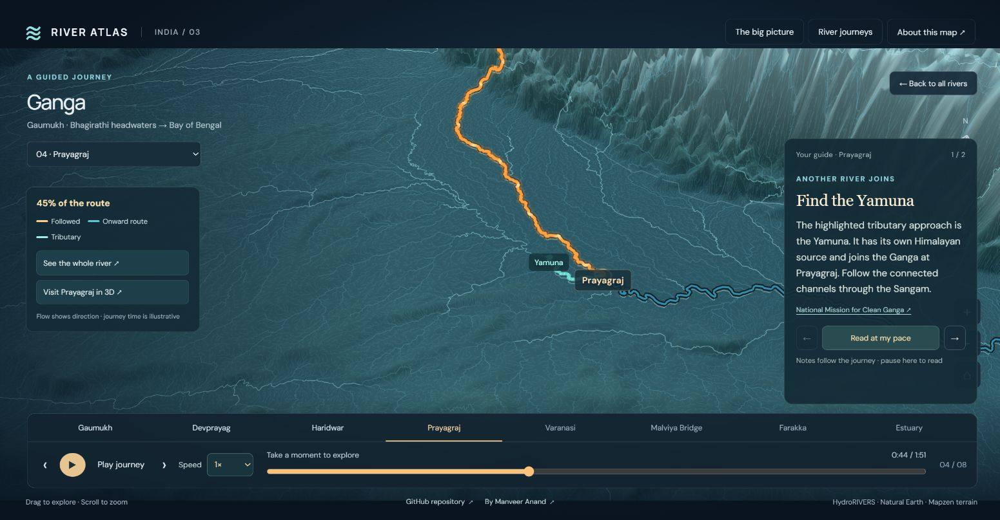
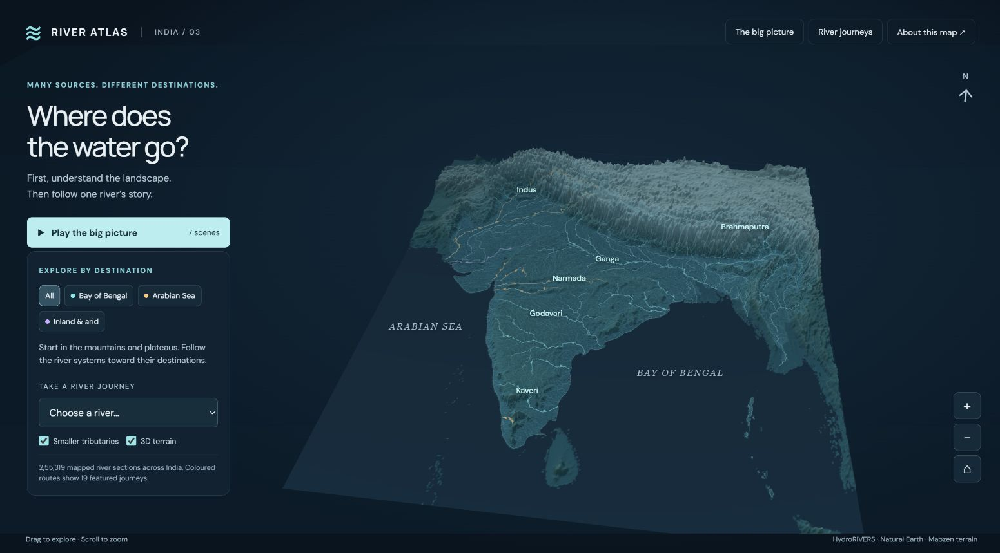
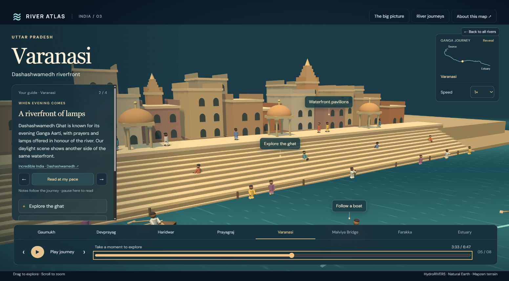
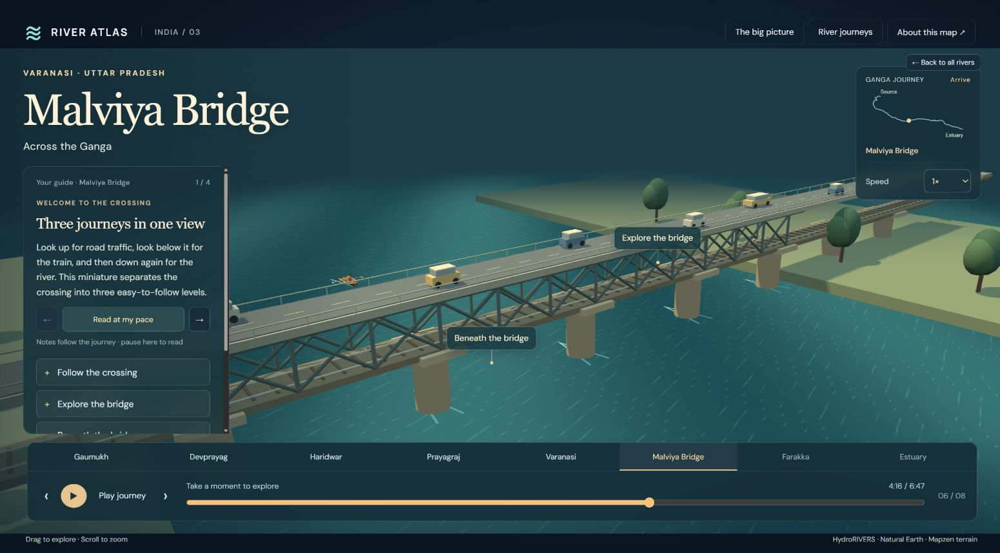

<div align="center">

# 🌊 India River Atlas

### Many sources. Connected journeys. A river you can follow.

Follow India's connected rivers on a 3D map—from Himalayan headwaters
to the lower estuary—with optional visits to ghats, glaciers and bridges.

**[Launch River Atlas ↗](https://india-river-atlas.tecknight.workers.dev/)**

**19 river journeys · 8 optional Ganga miniatures · 30 map & travel notes**

[Explore the experience](#explore-the-experience) · [Run locally](#run-locally) · [Road to ready](#road-to-ready) · [Development guide](#development-guide)

**Status: actively in development** · Browser first · Blender later

</div>



<p align="center"><em>The river stays in view. Gold traces progress; blue shows the onward route; mint identifies a joining tributary.</em></p>

## Explore the experience

Start with the terrain and river network. Choose a river to follow its downstream route. The Ganga tour keeps the geographic map central. Choose a 3D visit at any of its eight stops to watch life beside the water, then return to your saved place.

| 🗺️ See the landscape | 🎬 Follow the river | 📖 Stay curious |
| --- | --- | --- |
| A 3D national atlas with mountains, drainage destinations and smaller tributaries. | A complete highlighted route, a growing downstream trace and eight optional Ganga visits. | Short destination and travel notes, source links, and a reading mode that holds your place. |



<p align="center"><em>255,319 mapped river sections provide the geographic context for 19 featured journeys.</em></p>

### Watch, read or take a detour

1. Choose **Ganga** and press **Play journey**. The map tour takes about **1 minute 52 seconds at 1×**, excluding optional visits.
2. Set the pace: **0.5× · 1× · 1.5× · 2× · 3×**.
3. Use **Read at my pace** to hold your place and browse the guide notes. **See the whole river** pauses for a wider route view.
4. At a stop, choose **Visit this place in 3D**, then select a landmark or viewpoint. **Continue journey** or **Return to map** resumes from the saved map position.
5. Jump between chapters or seek along the timeline. In a local detour, **Pause activity** freezes the people, boats and water too.

Other rivers retain their atlas journeys. Detailed local miniatures currently belong to the Ganga tour.

## Eight stops along the Ganga

**Bhagirathi headwaters → Ganga at Devprayag → plains and confluences → Padma connection → lower estuary**

| Stop | The scene | A closer look |
| --- | --- | --- |
| **01 · Gaumukh** | Glacier opening, rocky valley and gathering meltwater. | Follow the water into the headstream. |
| **02 · Devprayag** | Two Himalayan channels meeting beside a hillside settlement. | Inspect the Bhagirathi and Alaknanda approaches. |
| **03 · Haridwar** | Har Ki Pauri-inspired steps, terraces and bathing activity. | Move between the terrace and water's edge. |
| **04 · Prayagraj** | Broad confluence, sandbanks, boats and a shore landing. | Take a boat viewpoint at the Sangam. |
| **05 · Varanasi** | Dashashwamedh-inspired ghats, pavilions, lanes and boats. | Explore the ghat, follow a boat or look from above. |
| **06 · Malviya Bridge** | Steel trusses, masonry piers, road traffic and a separate railway deck. | Follow a crossing or look beneath the bridge. |
| **07 · Farakka** | Barrage gates and schematic onward water connections. | Compare routes or reveal the structure beneath the deck. |
| **08 · Lower estuary** | Broad water, low banks, islands and boats. | Return to the atlas and trace the completed journey. |



<p align="center"><em>Take a closer look when you want one: the miniature is an optional detour.</em></p>



<p align="center"><em>Malviya Bridge: the river journey meets a road-and-rail crossing.</em></p>

## Road to ready

**We are building this iteratively until the experience is ready.** All eight Ganga miniatures are implemented; visual polish, usability and measured performance remain part of the work. The screenshots show the current build, not a finished release.

### Working today

- National terrain, 19 selectable river journeys and connected downstream routes.
- A map-first Ganga tour with eight optional miniatures and selectable viewpoints.
- Animated people, rowing and passenger boats, water movement, cars, a bus and a train.
- City and destination labels, a route locator, chapter jumps and timeline seeking.
- Five playback speeds and 30 map and travel guide notes; destination descriptions accompany 3D visits.
- Responsive controls and automated route, scene, placement and guide checks.

### Before we call it ready

- [ ] Review every arrival, reveal, observation and departure for framing, pacing and clear downstream orientation.
- [ ] Inspect people, stairs, shorelines, boats and vehicles through complete animation cycles; refine any clipping or awkward movement.
- [ ] Refine city names, landmark labels and explanatory notes for readability without covering important activity.
- [ ] Verify play, pause, seek, replay, chapter jumps, exploration and return in every scene, including repeated revisits and river switches.
- [ ] Review narrow screens, keyboard navigation and reduced-motion presentation across the full journey.
- [ ] Measure frame rate and resource use in the target browsers; tune toward the initial **30 fps** target.
- [ ] Complete a continuous start-to-finish visual review, then refresh screenshots, documentation and the downloadable browser package.

Sound, seasonal water controls, additional detailed river journeys and Blender production are later phases. Publication is outside the current local release plan.

## Run locally

**No dependency installation or build step is needed.** The static browser app lives in `dist/`, with Three.js and geographic assets included.

From the repository root, with **Python 3** installed:

```sh
python -m http.server 8765 --bind 127.0.0.1 --directory dist
```

On Windows, use `py -3` in place of `python` if needed.

Open **[http://127.0.0.1:8765/](http://127.0.0.1:8765/)** in a browser with WebGL support. Choose **Ganga → Play journey** for the map tour and optional miniature visits.

## Development guide

Each iteration follows a simple loop:

**Focus on one improvement → run checks → inspect it in the browser → commit the reviewed result.**

With **Node.js 20 or later**:

```sh
node scripts/check.mjs
```

Checks cover module syntax and imports, downstream route continuity and endpoints, all eight miniatures at two detail levels, route stroke visibility and backward seeking, deterministic animation seeking, stair and bridge placement, resource disposal, and guide-note coverage.

Visual changes also need browser review: inspect the affected scene, its controls and a narrow viewport. Automated geometry checks do not replace watching the experience.

<details>
<summary><strong>Where to make changes</strong></summary>

| File | Purpose |
| --- | --- |
| `dist/atlas.mjs` | Playback, river selection and journey state |
| `dist/terrain-view.mjs` | National terrain and river map |
| `dist/river-rendering.mjs` | Constant-width route highlights and directional flow cues |
| `dist/story-data.mjs` | River chapters and geographic stops |
| `dist/story-engine.mjs` | Route sampling and journey timeline |
| `dist/scene-data.mjs` | Miniature definitions, camera shots and points of interest |
| `dist/local-models.mjs` | 3D geometry and ambient activity |
| `dist/local-scenes.mjs` | Scene transitions, camera detours and resource lifecycle |
| `dist/guide-data.mjs` | Destination and travel notes with factual references |
| `dist/journey-guide.mjs` | Guide controls and reading mode |
| `dist/cinema.css` and `dist/index.html` | Presentation and responsive controls |
| `docs/images/` | Real browser screenshots used in this README |

If a browser retains an older module or stylesheet after a change, update the corresponding version query in its imports or in `dist/index.html`.

</details>

### Plans and references

- [Ganga journey guide, scene details and references](outputs/ganga-living-journey-guide.md)
- [River simulation plan and later Blender work](outputs/river-simulation-plan.md)

## Geographic treatment

India's rivers have **many separate source regions**. Tributaries generally join downstream; they do not all branch from one common origin.

This Ganga journey starts with the Bhagirathi headwaters and follows the existing mapped route through the Padma connection. The Farakka feeder-channel and lower-estuary miniatures are schematic; they do not add a complete Hooghly branch or new distributaries to the geographic dataset. The mapped endpoint lies upstream of the open sea.

Local scenes are stylized educational illustrations, with approximate chapter anchors rather than surveyed reconstructions. Water movement, people and traffic are illustrative animations. Playback speed changes the pace of the illustrative presentation and flow cues; it does not represent physical water speed or real travel time.

<details>
<summary><strong>Data credits and third-party terms</strong></summary>

The app includes HydroRIVERS v1 Asia river sections, Natural Earth geographic context, and sampled Mapzen / Tilezen terrain. The India view contains **255,319 river sections**, not 255,319 separately named rivers. Data credits and limitations also appear in **About this map**.

- [HydroRIVERS](https://www.hydrosheds.org/products/hydrorivers) — [included terms](dist/data/hydro-license.pdf) and [technical documentation](dist/data/HydroRIVERS_TechDoc_v10.pdf)
- [Natural Earth](https://www.naturalearthdata.com/)
- [Mapzen / Tilezen terrain](https://registry.opendata.aws/terrain-tiles/)
- [Three.js MIT license](dist/vendor/LICENSE-three.txt)

The original project code has no added redistribution license. Third-party components and datasets retain their own terms.

</details>

---

<p align="center"><strong>Start with the landscape. Stay for the river's story.</strong></p>
